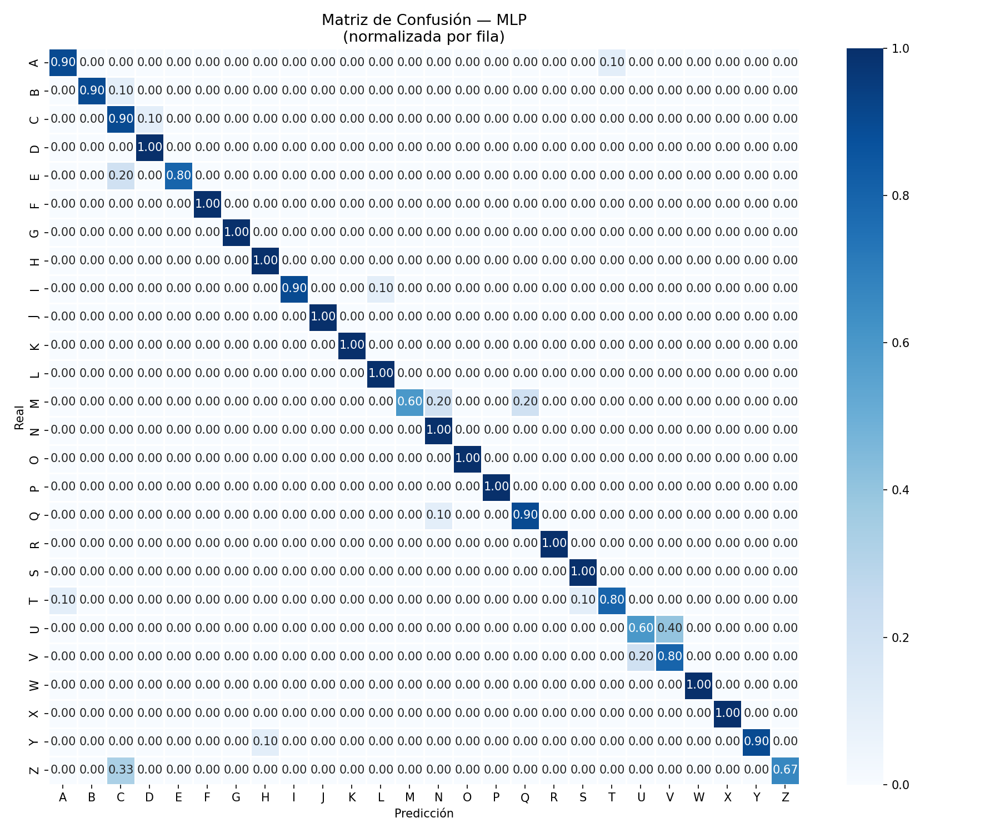

#  TRADUCTOR LSM — Lengua de Señas Mexicana

Sistema de reconocimiento y traducción de señas del alfabeto dactilológico mexicano en tiempo real, usando visión por computadora y aprendizaje automático.

> **Estado actual:** En desarrollo activo · Dataset estático completo (23/26 señas) · Señas de movimiento en recolección (J, K, Z)

---

## Demo



*Matriz de confusión normalizada — Modelo MLP · Accuracy 91.2% · F1 ponderado 91.1%*

---

## Descripción

El proyecto captura landmarks de manos con **MediaPipe Hand Landmarker**, los normaliza respecto a la muñeca y los clasifica con un pipeline sklearn. Distingue las 26 letras del alfabeto dactilológico LSM, incluyendo señas estáticas y señas que requieren movimiento (J, K, Z).

El sistema puede acumular letras en tiempo real mediante votación mayoritaria y auto-confirmación por estabilidad, construyendo palabras desde la cámara.

---

## Estructura del proyecto

```
TRADUCTOR_LSM/
├── src/
│   ├── collect_dataset.py    # Recolección de dataset con webcam
│   ├── analizar_dataset.py   # EDA y preprocesamiento
│   ├── entrenar_modelo.py    # Entrenamiento del clasificador
│   └── inferencia_lsm.py     # Inferencia en tiempo real
├── data/
│   └── processed/
│       ├── dataset_lsm.csv       # Dataset estático (landmarks x seña)
│       ├── secuencias_lsm.json   # Secuencias de movimiento (J, K, Z)
│       ├── mejor_modelo.pkl      # Pipeline entrenado (MLP + StandardScaler)
│       ├── label_encoder.pkl     # LabelEncoder de clases
│       └── confusion_matrix.png  # Métricas visuales del modelo
├── models/
│   └── hand_landmarker.task  # Modelo MediaPipe (se descarga automáticamente)
└── README.md
```

---

## Instalación

**Requisitos:** Python 3.10+

```bash
git clone https://github.com/gabescamilla2-sketch/TRADUCTOR_LSM.git
cd TRADUCTOR_LSM
pip install mediapipe opencv-python scikit-learn pandas numpy matplotlib seaborn joblib
```

El modelo de MediaPipe (~25 MB) se descarga automáticamente la primera vez que se ejecuta `collect_dataset.py` o `inferencia_lsm.py`.

---

## Uso

### 1 · Recolectar datos (opcional si ya existe el CSV)

```bash
python src/collect_dataset.py
```

| Tecla | Acción |
|---|---|
| `ESPACIO` | Capturar muestra estática |
| `M` | Capturar secuencia de movimiento (3 s) |
| `N` | Siguiente seña |
| `Q` | Guardar y salir |

### 2 · Entrenar el modelo

```bash
python src/entrenar_modelo.py
```

Entrena RandomForest, SVM y MLP; selecciona automáticamente el mejor por F1 en validación y guarda los artefactos en `data/processed/`.

### 3 · Inferencia en tiempo real

```bash
python src/inferencia_lsm.py
```

| Tecla | Acción |
|---|---|
| `ESPACIO` | Confirmar seña manualmente |
| `B` | Borrar última letra |
| `C` | Limpiar texto completo |
| `Q` / `ESC` | Salir |

---

## Resultados del modelo

| Modelo | CV F1 (5-fold) | Val F1 | Test Accuracy |
|---|---|---|---|
| **MLP** *(ganador)* | 0.923 ± 0.025 | 0.941 | **91.2%** |
| RandomForest | 0.892 ± 0.014 | 0.924 | — |
| SVM | 0.883 ± 0.018 | 0.921 | — |

**Señas con mejor rendimiento (F1 = 1.00):** F, G, O, P, R, W, X

**Señas más difíciles (F1 < 0.80):** U, V, C — morfológicamente similares entre sí

---

## Pipeline

```
Webcam → MediaPipe Hand Landmarker → normalizar_mano()
       → vector 63 features (21 puntos × x, y, z)
       → StandardScaler → MLP Classifier
       → votación mayoritaria (ventana 10 frames)
       → predicción estabilizada
```

**Features:** 63 valores flotantes por frame — coordenadas (x, y, z) de los 21 puntos de referencia de la mano, normalizados respecto a la muñeca (punto 0).

**Señas de movimiento (J, K, Z):** se representan con 378 features estadísticos extraídos de secuencias de 26 frames (media, std, mín, máx, rango y pendiente lineal por feature).

---

## Limitaciones conocidas

### Dataset
- **Esquema de columnas desincronizado:** el CSV fue generado con una versión anterior del colector que no escribía los prefijos `izq_`/`der_` en el encabezado. Las columnas 64–126 quedaron sin nombre (`Unnamed: 64..126`). El script `entrenar_modelo.py` maneja esto automáticamente colapsando ambas mitades en 63 features unificados.
- **Dataset monomano:** cada muestra usa una sola mano (izquierda o derecha), ya que el dataset fue capturado alternando manos por seña. El modelo funciona correctamente porque aprende de ambas, pero es más robusto con la mano dominante.

### Código
- `cv2.CAP_MSMF` en `collect_dataset.py` (línea 393) es exclusivo de Windows. En Linux usar `cv2.VideoCapture(0)` o `cv2.CAP_V4L2`.
- La inversión de handedness para visualización en `collect_dataset.py` construye objetos vacíos que pueden generar warnings con algunas versiones de DrawingUtils.
- El reporte en `analizar_dataset.py` tiene hardcodeado `"/23"` en lugar de calcularlo dinámicamente.
- `analizar_dataset.py` busca columnas con prefijo `izq_`/`der_` que no existen en el CSV actual; la función `visualizar_landmarks()` sale silenciosamente sin graficar.

---

## Roadmap

- [ ] Completar 50 secuencias de J, K y Z
- [ ] Regenerar CSV con prefijos `izq_`/`der_` usando el colector actual
- [ ] Agregar soporte para palabras completas (no solo letras)
- [ ] Exportar modelo a ONNX para inferencia más ligera
- [ ] Interfaz gráfica con Tkinter o PyQt

---

## Tecnologías

- **MediaPipe 0.10+** — detección de landmarks de manos
- **OpenCV** — captura y procesamiento de video
- **scikit-learn** — MLP, RandomForest, SVM, Pipeline, StandardScaler
- **pandas / numpy** — manejo del dataset
- **joblib** — serialización del modelo

---

## Autor

**Gab Escamilla** · [@gabescamilla2-sketch](https://github.com/gabescamilla2-sketch)
